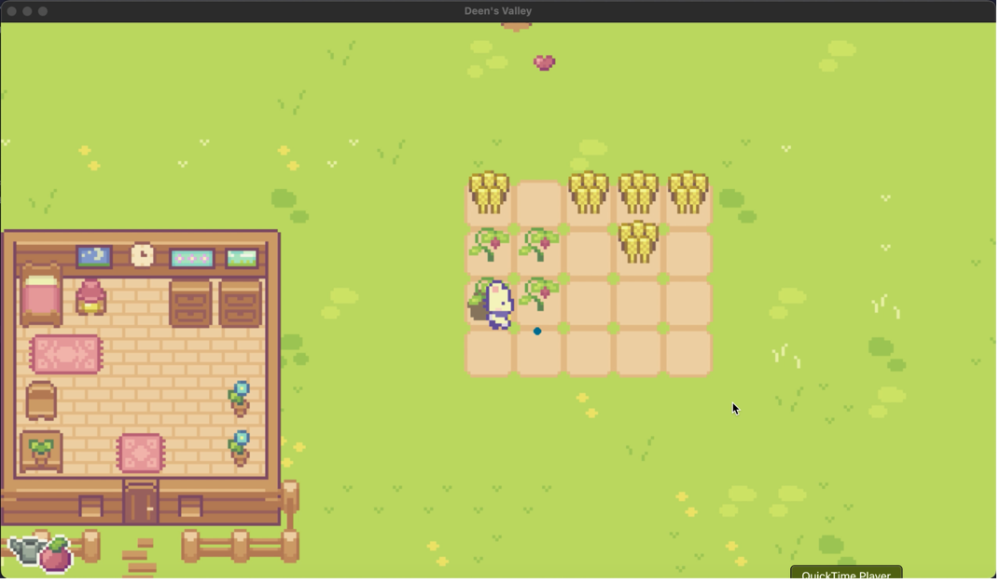
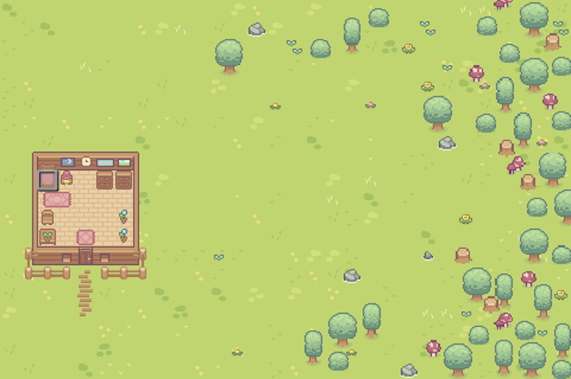
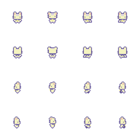

## Part 1: Vision Statement
### Game Synopsis:
My game Deen’s Valley is created based off of the famous game Stardew Valley. The name “Deen’s Valley” comes from my current Research in Restoration Ecology class where we are restorating a plot of land named “Deen’s Garden” at our local botanical garden. Deen’s Valley combines Stardew Valley and learning about restoration, ecology, and biodiversity. You live on a small plot of rural land, where you will farm plants, harvest wood and apples from trees, and learn about South Carolina’s natural ecosystems. It is a serious, educational game and can also just be a fun pastime.
### Platform:
The platform of the game is the Pygame interface. The game is written in Python, and when it is run, it will create a Pygame window where the game is played.
### Appeal:
My hope is that Deen’s Valley will appeal to fans of Stardew Valley as well as people who are interested in restoration, nature, or the environment. I think that anyone who likes games like Stardew Valley or other relaxing games will enjoy it. Also, the game can be used for educational purposes by teachers who want to teach their young students about ecology in a fun, new way.
## Part 2: Formal Elements
### Player:
There is only one player in the game, which is controlled by the user. It is a small bunny sprite who moves around the farm –planting and harvesting vegetables, cutting down trees, and hanging around its small wooden house. You use the arrow keys to move around, the space key to perform actions, and a few other keys to help you along the way.

The player interaction pattern is player vs. game, although it is not in a competitive way. You are simply just a character interacting with the game world and living off of the land.
### Objectives:
The main objective of the game is to grow your farm and prosper as a small farmer. This is achieved by tilling soil, sowing seeds, watering plants, harvesting vegetables, and general farm things. You can sell your harvested plants for money, which in turn can be used to buy more seeds. You can also get wood and apples by cutting down trees, and both can be sold for more money.

The less obvious objective is to learn about species in South Carolina. If you stand near a tree and hold the RETURN/ENTER key, a small box in the bottom right corner will display the species information. Each shrub and tree’s information will help you explore the natural landscape of South Carolina and learn about native vs. invasive species. Because the species in the game exist in the real world, this game is a very helpful learning tool and can be seen as an educational game.
### Resources:
You have three different tools to use:
1.	Hoe - this is used to till the soil to be able to plant seeds which will grow into plants
2.	Axe - this is used to cut down trees to obtain wood and apples or to cut down trees that you learn are invasive and dangerous to the ecosystem’s biodiversity
3.	Watering Can - this waters your plants to make sure they grow

Money:
    You start with $200 which you can use to buy seeds which are needed to obtain plants. You can also obtain more money by selling the vegetables you have grown as well as apples or wood.

Seeds:
    You only start with 5 seeds each of tomato and corn plants. You need seeds to be able to grow plants, and you can always buy more in your inventory with your money.

Vegetables:
    You can sell your corn and tomatoes to obtain more money.
### Conflicts and Obstacles:
There are really no direct obstacles in this game. I wanted it to be fun and not stressful, which is why you have nothing hindering you from the day cycle game play. However, there is a small obstacle in the nature of growing plants. The plants will only grow overnight, so you have to sleep every once in a while to make sure your crops mature.

In the future, I want to add a timer for the day cycle, so you have a fixed amount of time to do everything you want until the day cycle starts over. Therefore, you have to make sure you water all of your plants before the day ends if you want them to grow overnight.
### Rules and Procedures:
#### Gameplay:
    You start in the middle of the plot, which you must start exploring. You can learn more about the trees and shrubs by holding ENTER/RETURN when you’re standing near them, and you can also test out the tools that you have. Once you get the hang of using all of your tools, you can start growing crops. You will also explore your small wooden home, which is where you sleep for the night cycle to occur. All of this is pretty simple, so that is why there is no starting screen with explicit instructions. However, at any time during the game, you can press ‘h’ to see all of the key commands and you can also press ‘p’ to see the general game instructions and rules.

#### Rules:
There are very few rules when it comes to this game, but they are crucial for your farm to grow.
1.	crops only grow at night
2.	crops only grow overnight if they are watered
3.	apples regenerate overnight
4.	once cut down, trees cannot grow back, so be careful about cutting down all of your trees
## Part 3: Dramatic Elements
### Challenges:
I didn’t want to include too many challenges in this game because the target audience is people who want a relaxing, simple game as well as young students. Because of this, this game is pretty straightforward. The challenges that exist are that you can’t grow back trees, which teaches you to cut down only the ones you have to, which could also be the invasive tree species you don’t want. Another challenging task, which I have not implemented yet but will soon, is the day cycle I described before. You will only have a set amount of time to do everything you want to do each day, so you need to budget your time in terms of what you would like to water, sow, and harvest.
### Play:
The playful aspect of the game is pretending you are a real life farmer. I think this is a common theme throughout a lot of games, so I’m glad I was able to make this a big part of Deen’s Valley but in my own way. Farming is pretty simple but it can be entertaining and fun to do because there’s something interesting about having a routine and living off of the land.
### Story:
There is no story in the game currently, but I hope to add a starting scene in the beginning where it gives the character bunny that you control a little background story, like the one in Stardew Valley and in a lot of other games.
### Setting and Game World:
The game takes place on a small plot of rural land. It is supposed to be simple and peaceful, which is why the graphics used to create the world are simple 16-bit tiles and objects. This adds to the feeling of an innocent fun game that anyone can enjoy as a simple pastime and as a way to learn about plant species.
## Part 4: User Interface
### Manual Interface:
Command Keys:
- Q: change tool, rotates through your hoe, axe, and watering can
- SPACE: use tool, uses selected tool, which is displayed in the bottom left corner
- E: change seed, rotates through corn and tomato seeds
- S: use seed, plants a seed of the selected plant, found in the bottom left corner
- Arrow Keys: move around (up, left, down, right)
- RETURN/ENTER: sleep when character is in bed, buys and sells items in the inventory, displays plant information when standing near a tree or shrub
- I: open inventory
- P: displays general instructions and information about the game
- C: displays game credits
- H: displays all these commands
- ESCAPE: exits the current menu (inventory, game info, game credits, and help menu)
### Visual Interface:
The camera viewpoint is a birds-eye view and the game is a top-down game. This is just the most simple way to create a game of this type, so that’s why I chose it.

The information displayed on the screen is the selected tool and selected seed type. This is super useful because the tool the character is holding can be small and the seed is not even shown with the character sprite. Information can also be shown on the screen when the respective key is pressed to activate a menu.

All-in-all, the visual interface is pretty simple and I chose this because I don’t want the game to be too confusing, plus I like minimalistic styles.

Below are pictures of the entire plot and what the game interface looks like.

## Part 5: Game Art
I wanted the art style to be pixel art and pretty simple but cute. I found a free Asset Pack by Cup Nooble linked here: [Cup Nooble Itch IO Page](https://cupnooble.itch.io/). This is what I used for all the graphics including the ground tiles and objects. This just emulates the Stardew Valley feel, and I also just like it because it’s very cute. 

Here is a picture of the character sprite sheet to show what the general art style is, and you can also see more about the art style in the user interface section. 

## Part 6: Game Build
I used Python and the Pygame library to build this game. I followed Clear Code’s Tutorial closely to create this game: [Youtube Tutorial](https://www.youtube.com/watch?v=T4IX36sP_0c&t=9718s). The game at this point is fully functional, but like any game, there are still things that I can add to it. The game is run from main.py, but all the game scripts include:
*	main.py (driver code where game loop occurs)
*	level.py (includes game class to run the game)
*	player.py (includes the player class which is where, along with level.py, most of the user interaction takes place)
*	util.py (includes the settings and utilities used throughout the code)
*	soil.py (includes the soil class where soil interaction is handled)
*	overlay.py (includes the overlay class where the overlay of tools and seeds in the bottom left corner is created and displayed)
*	sprites.py (includes all sprite classes where tiles and objects are handled)
*	support.py (more utilities where import functions live)
*	timer.py (includes the timer class which handles pygame timers)
*	transition.py (includes the transition class which handles the day to night to day transition)
*	help.py (includes the menu classes which handle the help menu, credit screen, and the general game info)
*	menu.py (includes the inventory menu class which handles the inventory)
*	plantinfo.py (includes the plantinfo class which extends menu class and handles the plant information displays)
## Part 7: Game Playtesting
*	Do the rules work?
*	Can a player achieve his or her objective?
*	Are there significant challenges for players that make the game engaging?
*	Does the game have the right level of challenge?
*	Is the game fun?

